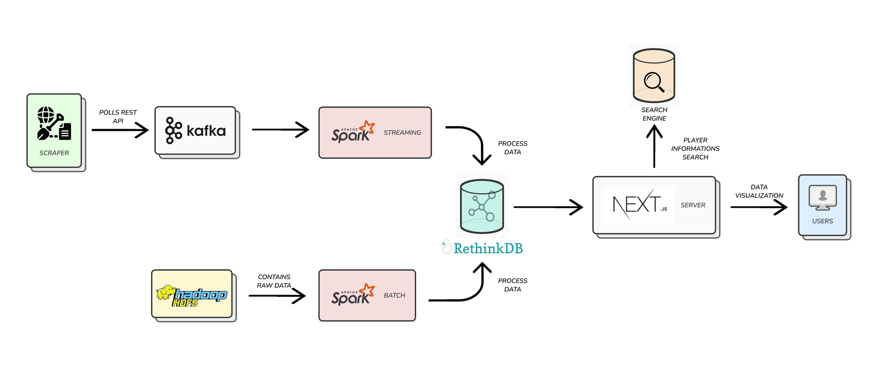
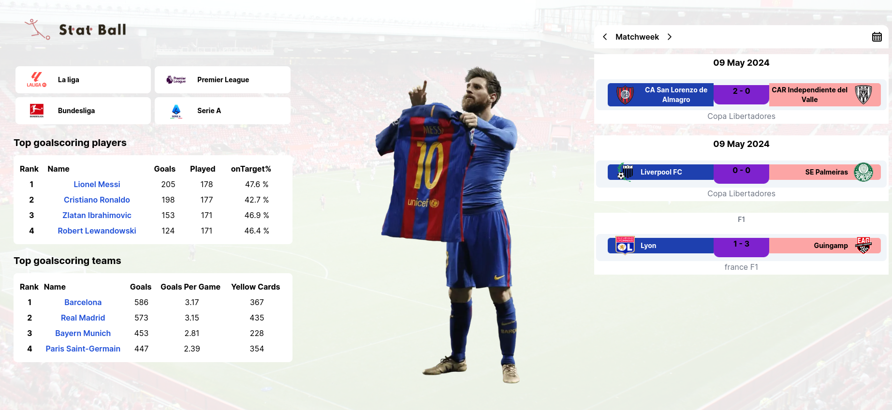
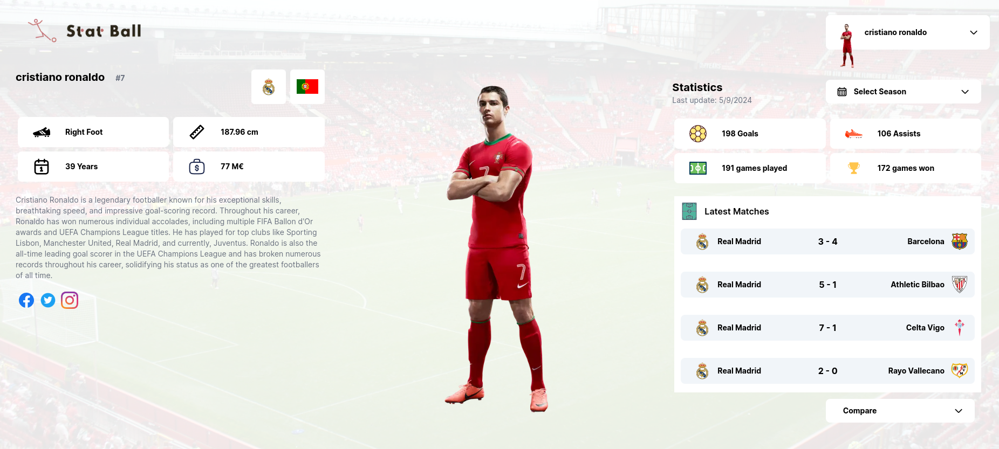
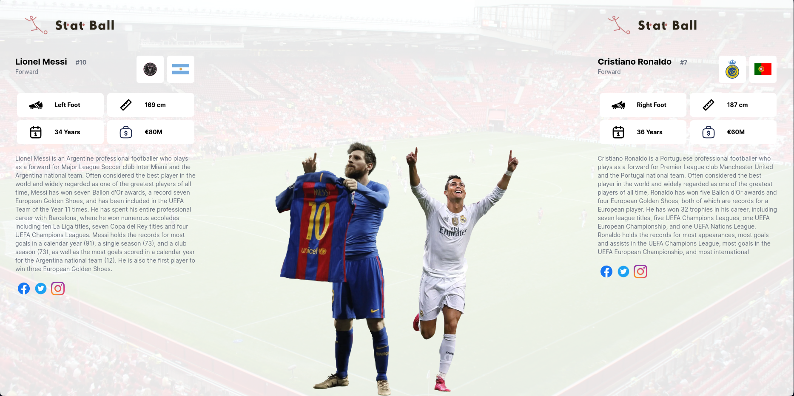
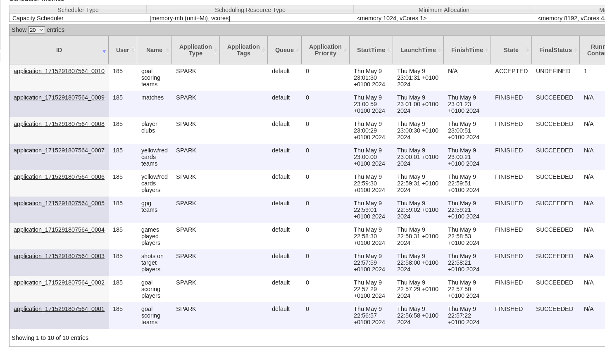

# Football Big Data

This is a project for processing large amounts of football data and computing statistics on teams and players on previous data as well as real-time data being streamed into the project.

Using Apache Hadoop HDFS to store raw data, Spark for processing data and YARN for orchestrating the spark jobs, RethinkDB for storing processed data, Kafka to handle streaming of new data from the scraper and Nextjs (create-t3-app) for the web app.

## How does this work ?

This project is composed of 2 pipelines, one for streaming data and another for batch processing.

## How do I run this ?

- Run `bash start.sh` (note that if you are on windows you can run it on a git bash terminal)

If running for the first time run `bash start.sh download-data` in order to download the datasets we're going to be using.

- Run `docker compose up` to start the whole project. Make sure you have enough space on disk in order for everything to work smoothly. Running this on `windows` will cost extra performance overhead (and noticeable too).

- You can check the UI at `http://localhost:3010`. It probably will take some time depending on your resources in order for the initial processed data to be ready. You can check out the progress at `http://localhost:8088/cluster/apps`. There should be 9 different jobs completed.

## How do I submit my own spark application ?

- Run `docker compose run spark bash` to launch a shell inside the container.

- Run `../bin/spark-submit mount/spark/main.py` and it will load all datasets file into spark.

- Run an sql query on it.

## I am done experimenting with this project

- Running `docker system prune` helps getting rid of all volumes, build cache, etc ... that take up space on your machine. BE CAUTIOUS! Running this command will remove all stopped containers (among other unused stuff). You can also try its sibling commands: `docker buildx prune` (for clearing unused build cache) and `docker volume prune` (for clearing unused volumes).

## Screenshots

### Home page

### Player page

### Compare page

### Spark applications

